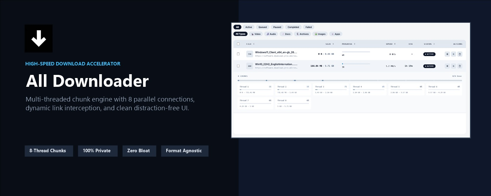
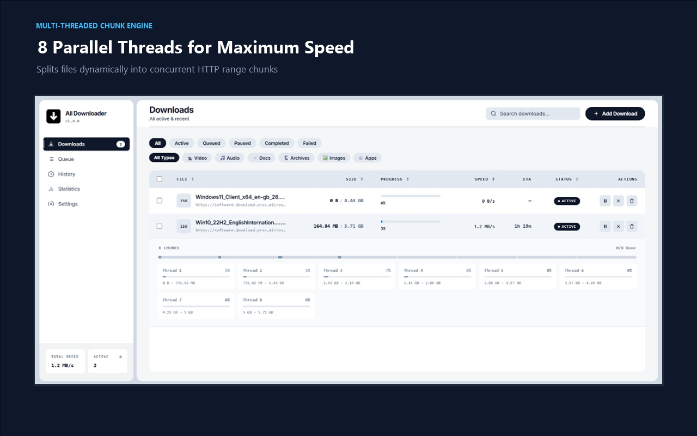
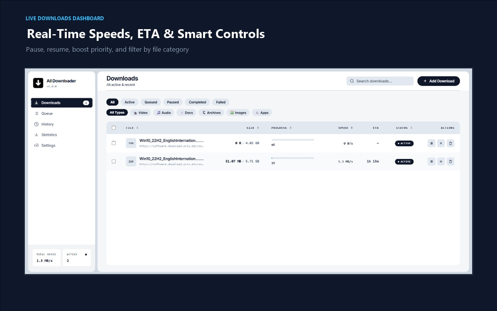
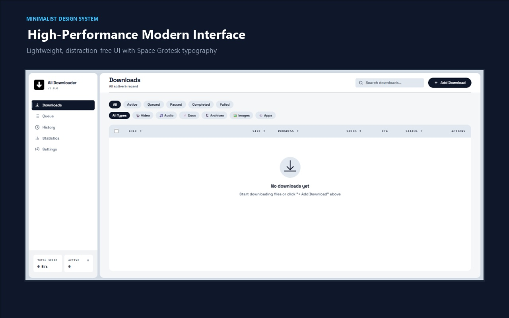

# All-Downloader Extension

> A **secure**, **high-speed**, **open-source** browser download manager — built for speed, privacy, and power.


<p align="center">
  
</p>

---

## 📸 Interface & Architecture Showcase

### ⚡ 8-Thread Parallel Chunk Acceleration
Splits downloads dynamically into concurrent HTTP range chunks to saturate available bandwidth, complete with per-thread real-time progress bars and byte range metrics.
<p align="center">
  
</p>

### 📊 Live Downloads Dashboard
Monitor active download speeds, rolling-window ETA, categorized file filters, and instant action controls (pause, resume, boost priority, cancel).
<p align="center">
  
</p>

### 🎨 Distraction-Free Minimalist UI
High-contrast Vercel-inspired architecture rendered 100% offline with bundled Space Grotesk variable typography.
<p align="center">
  
</p>

---

## ✨ Features

| Feature | Description |
|---------|-------------|
| 🚀 Multi-segment downloads | Splits files into 8 parallel chunks like IDM |
| ⏸ Pause / Resume | Byte-range aware — resumes exactly where it stopped |
| 📋 Smart queue | Configurable concurrency, priority reordering |
| ⏰ Scheduler | Download at a specific date/time via chrome.alarms |
| 🔐 SHA-256 integrity | Verifies file hash using Web Crypto API — no deps |
| 📊 Statistics | Speed, ETA, category breakdown, lifetime totals |
| 🎨 Beautiful UI | Dark slate & minimalist theme, Space Grotesk typography |
| 🌍 Download Interceptor | Smart intent tracking for browser downloads & context menus |
| 🔒 Zero telemetry | No analytics, no server, 100% local |

---

## 🎨 Color Palette

| Token | Hex | Usage |
|-------|-----|-------|
| Sky Blue | `#8ecae6` | Progress fills, secondary accents |
| Ocean | `#219ebc` | Primary buttons, active states |
| Deep Navy | `#023047` | Backgrounds, base surface |
| Amber | `#ffb703` | Speed display, warnings |
| Orange | `#fb8500` | CTAs, errors, badges |

---

## 📁 Project Structure

```
All-Downloader-Extension/
├── manifest.json               ← MV3 extension manifest
├── cws-assets/                 ← Chrome Web Store promo banners & 1280x800 screenshots
├── PRIVACY_POLICY.md           ← Complete data privacy policy & disclosures
├── vite.config.ts              ← Unified Vite + Vitest packaging & bundler config
├── tsconfig.json               ← TypeScript compiler configuration
├── src/
│   ├── background/
│   │   ├── service-worker.ts   ← MV3 service worker entrypoint
│   │   ├── download-engine/    ← Multi-chunk fetch engine, probe & host governor
│   │   ├── queue-manager.ts    ← Priority queue, scheduler & concurrency limiter
│   │   └── services/           ← Download coordinator, keep-alive, router & offscreen
│   ├── dashboard/              ← Single-page application dashboard (HTML, CSS, TS)
│   ├── popup/                  ← Toolbar quick-action popup (HTML, CSS, TS)
│   ├── offscreen/              ← Offscreen document for Blob assembly & hashing
│   ├── content/                ← Download link interceptor content script
│   ├── shared/                 ← Constants, types, chunk helpers & utilities
│   └── assets/
│       ├── fonts/              ← Bundled SpaceGrotesk.ttf (100% offline variable font)
│       └── icons/              ← Extension icons (16px, 32px, 48px, 128px)
├── tests/unit/                 ← Comprehensive Vitest unit test suite (133 passing tests)
└── package.json
```

---

## 🚀 Load in Chrome (Developer Mode)

1. Run `npm run build` (or `npm run dev` during development)
2. Open `chrome://extensions`
3. Enable **Developer Mode** (top right)
4. Click **Load Unpacked**
5. Select the **`dist/`** folder
6. Pin the extension to the toolbar

---

## 🛠️ Development & TypeScript

```bash
npm install         # Install dev dependencies
npm run dev         # Watch mode: live build on changes (vite build --watch)
npm run typecheck   # Type-check TypeScript sources (tsc --noEmit)
npm test            # Run unit tests with Vitest
npm run bundle      # Fast bundle with Vite (npx vite build)
npm run build       # Full build: typecheck + Vite build + package dist/ & zip
```

---

## 🔐 Security

- **Manifest V3** — strict CSP, no eval, no remote code
- **No external servers** — all processing is local
- **SHA-256 file integrity** — via native SubtleCrypto
- **Minimal permissions** — only what is absolutely needed
- **Open source** — full code audit welcome

---

## 📄 License

MIT © All-Downloader Contributors
